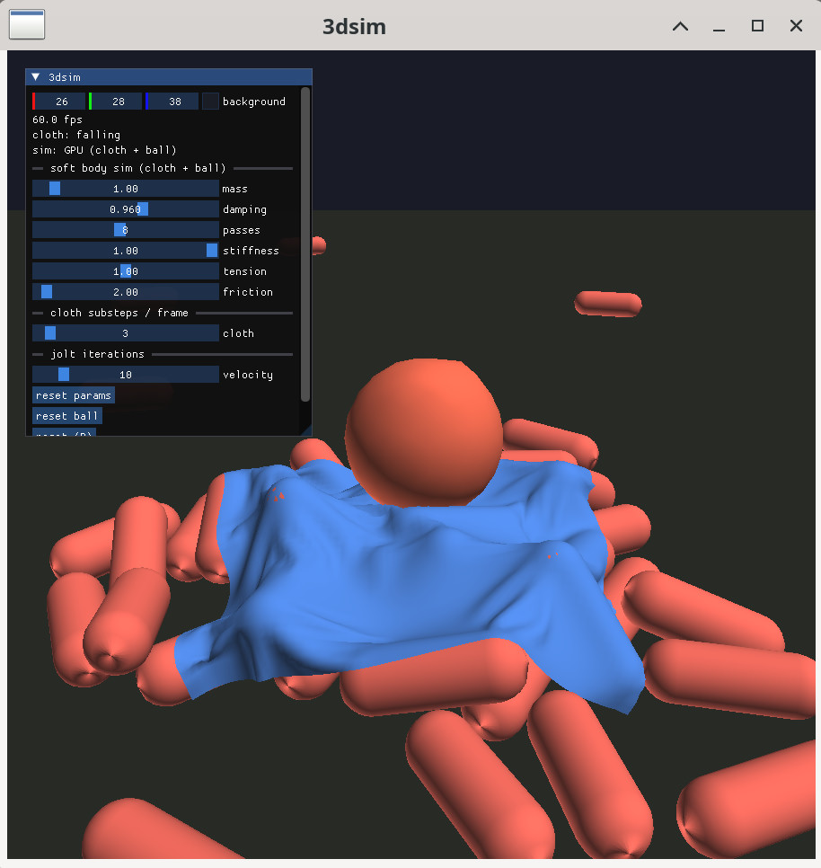

# 3dsim

Jolt rigid-body physics with a GPU soft-body simulation (Vulkan compute). The cloth and ball are simulated on the GPU, using capsules from Jolt as colliders.



## Build & run

```sh
cmake -S . -B build -Wno-dev
cmake --build build -j
./build/vksim                          # interactive
```

Re-run the `cmake -S .` step after editing a shader — SPIR-V is baked in at configure time.

## Dependencies

Vulkan SDK (`glslc`) and `xxd`. GLFW, Jolt, ImGui and EnTT are bundled under `lib/`.
