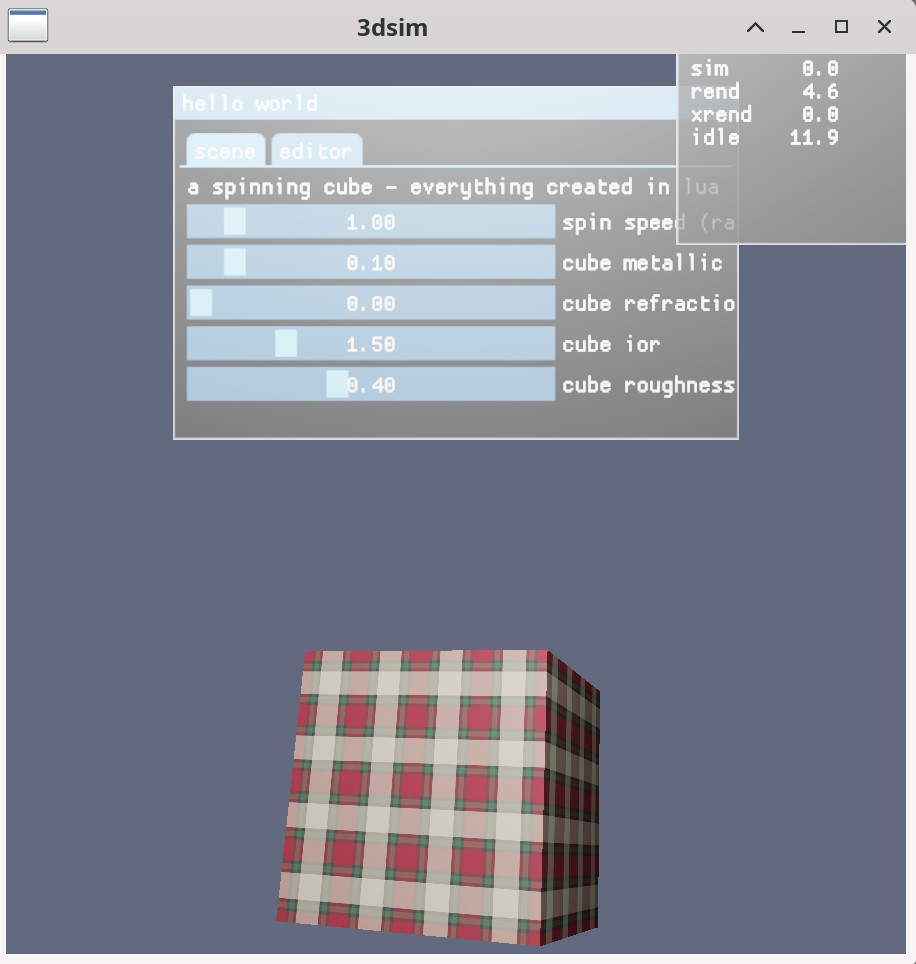

# 3dsim

A data-driven 3D engine: ENTT ECS scene graph, Jolt rigid-body physics, GPU soft-body (PBD) and dual-quaternion skinning, a Vulkan renderer, OpenXR support, and Lua-scripted scenes. Two servers — `PhysicsServer` (CPU Jolt) and `GraphicsServer` (Vulkan + GPU soft-body/skinning sim) — each step once per frame with the frame's dt (clamped to 1/30 s) and exchange state only through ECS components; settings are data too (components on a marker entity, bindable by URL).



## Features

### Full GLTF support
Load GLTF files with full support for skeletons, shape keys, object hierarchy, and animations (clips + players), plus the full shader feature set including SSS + refraction.

### GPU soft-body cloth simulation
Cloth and soft bodies run entirely on the GPU as position-based-dynamics compute shaders (`shaders/softbody.comp`). Each body is a mesh plus flat constraint quads `{a, b, rest, k}` solved in substeps with per-body gravity, damping, friction, tension and stiffness, against a floor and up to `kMaxCapsules` dynamic capsule colliders. Vertices can be pinned with per-vertex weights (`soft.set_pins`, 0..1) that pull toward targets captured from the body itself or another mesh (e.g. a skinned character), refreshed on demand via `soft.update_pins`.

### Dual-quaternion skeleton skinning
Meshes deform on the GPU with dual-quaternion skinning plus shape keys

### PBR renderer
Forward Vulkan renderer implements metallic-roughness PBR with glTF texture conventions (G = roughness, B = metallic), emissive, normal scaling, opaque/transparent passes with alpha cutoff/blend modes, and **glass refraction**: a `refraction`/`ior` pair re-samples the blurred scene color and depth buffers for refracted views. A dedicated subsurface-scattering pass weighted per color channel. An optional `renderScale` supersamples the scene buffer (VR resolution is matched to the headset).

### Image-based lighting and shadow mapping
Environment maps are generated on the GPU from equirectangular textures with PCF-style texel filtering; light falloff is inverse-square with a hard front-facing gate.

### Jolt rigid-body physics
`PhysicsServer` wraps the Jolt engine on the CPU, stepping once per frame with the frame's dt (clamped to 1/30 s), and exposes a per-frame hook (`_physics` Lua callback) for data-driven behaviour. Scenes declare dynamic, kinematic and static bodies with box/capsule/sphere/tapered-capsule/convex-hull colliders, and point or 6-DOF joints (translation/angle limits, soft limits, per-axis motors); `collision_shape_solver_test` covers shape fitting (tapered-capsule compounds to arbitrary meshes).

### Collision shape decomposition
Two algorithms fit physics shapes to arbitrary meshes from Lua:
- **Tapered-capsule compounds** — `physics.fit_capsule` fits chains of tapered capsules (spheres for blob-like clouds) to a vertex cloud, with per-part error metrics. The solver in [`solvers/collision_shape_solver.h`](solvers/collision_shape_solver.h) is unit-tested by `collision_shape_solver_test`; the ragdoll workflow in [caps_fit.lua](assets/scenes/caps_fit.lua) fits each bone's rest-pose vertices and builds a TaperedCapsule skeleton from the result.
- **Convex hulls** — `physics.convex_decompose` runs CoACD convex decomposition ([`src/physics/mesh_decomp.cpp`](src/physics/mesh_decomp.cpp)) and returns per-part vertex sets ready for `ConvexHullShape` colliders; degenerate input falls back to a single full-mesh hull for small meshes. See [sword_decomp.lua](assets/scenes/sword_decomp.lua).

### OpenXR / VR
Full stereo OpenXR path: per-eye views from the runtime pose, controller tracking, and a clean camera hand-off — while an XR pose exists all scene cameras are deactivated and the VR camera drives rendering.

### Data-driven scenes and URL binding
Everything is ECS data: scenes are JSON (objects → named entities with components), settings are components on a marker entity, and any field of any component is addressable by URL (`name.Component.field`). UI widgets, scene `Bind` entries and script variables all read/write through the same resolver — so a slider can drive `Material.metallic`, a `Transform.pos`, or a Lua script variable with identical code.

### Lua scripting
Scenes attach behaviour via `"script": "scenes/<name>"` (or `scene.attach_script(e, file, params)`). Scripts get lifecycle hooks (`_on_ready`, `_animate`, `_physics`) and a per-attach instance table whose top-level variables are bindable by URL (`name.LuaScript.var`). Eight API tables: `scene` (entity/component CRUD, live component views, batch `spawn`, poses, keyframe `animate`, glTF, textures), `math` (vec/quaternion ops on top of the Lua stdlib), `physics` (raycast, capsule/convex decomposition, collision exceptions), `soft`, `graphics`, `ui`, `engine` (performance metrics), and `input`. A `mesh` standard library generates capsule/sphere/box/plane geometry. Documentation: [docs/LUA_GUIDE.md](docs/LUA_GUIDE.md) (conventions and walkthroughs) and [docs/LUA_API.md](docs/LUA_API.md) (full reference, generated from source annotations).

### Immersive UI and scene editor
A PBR-lit UI: windows, tabs, sections, text, sliders (f/i), checkboxes, color pickers, 3D drag gizmos and buttons are ECS widgets (entities with components) rendered via an ImGui Vulkan backend onto a lit canvas quad — so they respond to the scene's lights. Value widgets bind to any URL (component field or script variable); buttons/callbacks call `name.LuaScript.fn`. `ui.editor` embeds a full scene editor tab for inspecting and editing entities at runtime, and the `require("ui")` stdlib builds all of it from Lua.

## Hello World Scene

[assets/scenes/hello_world.lua](assets/scenes/hello_world.lua)

```lua
-- hello world: the scene json is blank (one object with this script attached); the camera,
-- light, textured spinning cube and UI are all created here in lua.

local uib = require("ui")

-- script variables, bindable via "hello.LuaScript.<var>"
spin_speed = 1.0

-- executed once, when the script is ready
function _on_ready(self)
    -- the fly camera: active=true is what makes it THE camera
    local camera = scene.entity("cam")
    scene.emplace(camera, "Transform", { pos = { 0, 1.2, 4 } })
    scene.emplace(camera, "Camera", { fovDeg = 50, active = true })
    scene.attach_script(camera, "scenes/camera") -- attaches the "fly camera movement" script which gives "look" and "wasd + qe" kb movement

    -- attach the VR controller script (enables movement and pointing with a VR controller setup)
    local vr = scene.entity("vr")
    scene.attach_script(vr, "scenes/vr_controller")

    local light = scene.entity("light")
    scene.emplace(light, "Transform", { pos = { 0, 3, 4 } })
    scene.emplace(light, "PointLight", { color = { 1, 1, 1 }, intensity = 60, radius = 0.5 })

    -- the textured cube: geometry entity -> renderable ref, texture entity -> material ref
    local tex = graphics.load_texture("cloth_albedo.png", "cube_tex")
    local mat = scene.entity("mat_cube")
    scene.emplace(mat, "Material", { baseColor = { 1, 1, 1 }, metallic = 0.1, roughness = 0.4, tex = tex })

    self.cube = scene.entity("cube")
    scene.emplace(self.cube, "Transform", { pos = { 0, 0, 0 } })
    local g = scene.entity()
    scene.emplace(g, "Geometry", mesh.box({ 0.5, 0.5, 0.5 }))
    scene.emplace(self.cube, "Renderable", { geom = g })
    scene.emplace(self.cube, "MaterialRef", { material = mat })

    -- the ui: one window, a text line, a spin-speed slider, and the scene editor
    local win = uib.make_window("hello world", 320, 200, { 0, 1.5, 2.8 })
    local tab = uib.tab(win, "scene")
    uib.text(tab, "a spinning cube - everything created in lua")
    uib.bind_slider(tab, "spin speed (rad/s)", "hello.LuaScript.spin_speed", 0, 10.0, "%.2f")
    uib.bind_slider(tab, "cube metallic", "mat_cube.Material.metallic", 0, 1.0, "%.2f")
    uib.bind_slider(tab, "cube refraction", "mat_cube.Material.refraction", 0, 1.0, "%.2f")
    uib.bind_slider(tab, "cube ior", "mat_cube.Material.ior", 1.0, 3.0, "%.2f")
    uib.bind_slider(tab, "cube roughness", "mat_cube.Material.roughness", 0, 1.0, "%.2f")
    uib.editor(uib.tab(win, "editor"))
end

-- runs every graphics frame
function _animate(self, dt)
    local speed = spin_speed
    local pose = scene.get_pose(self.cube)
    scene.set_pose(self.cube, pose.pos, math.qmul(math.qaxis({ 0.5, 0.5, 0 }, speed * dt), pose.quat))
end

-- runs every physics step
function _physics(self, dt)
    
end


```

[assets/scenes/hello_world.json](assets/scenes/hello_world.json)

```json
{
    "name": "hello world",
    "objects": [
        { "name": "hello", "script": "scenes/hello_world" }
    ]
}
```

## Lua documentation

- [docs/LUA_GUIDE.md](docs/LUA_GUIDE.md) — hand-written guide: type conventions (vec3/quat layout), entities/names/refs/URLs, live component views, script hooks, and the `ui`/`mesh` stdlibs.
- [docs/LUA_API.md](docs/LUA_API.md) — auto-generated per-function reference with return-table shapes and examples, plus the full component field reference (regenerated from source annotations by `tools/gen_lua_api.py`).

## Build & run

```sh
cmake -S . -B build -Wno-dev
cmake --build build -j
./build/vksim                          # interactive (default menu scene)
./build/vksim --scene assets/scenes/hello_world.json --no-vr  # load a scene, disable VR
```

Flags: `--scene <path>`, `--no-vr`, `--no-graphics` (CPU physics only), `--headless` (GPU compute, no window; simulates at a fixed 60 Hz timestep), `--frames <n>` (exit after n frames).

Shader edits are picked up automatically on the next build — SPIR-V is regenerated when a `.vert`/`.frag`/`.comp` source changes.

## Dependencies

Vulkan SDK (`glslc`), `xxd`, and system Lua 5.4. ENTT, GLFW, GLM, ImGui, Jolt, OpenXR and the small helpers (json, miniz, stb, tinyexr, tinygltf) are bundled under `lib/`.
